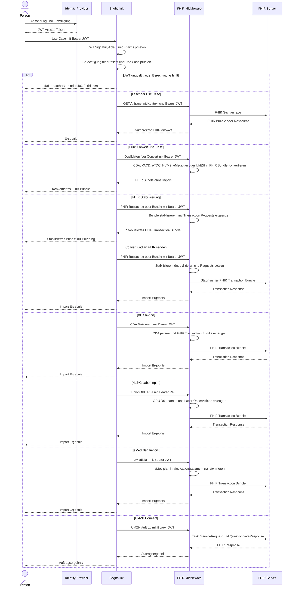

# Bright-link Sequenzdiagramm

Dieses Diagramm beschreibt die Zielarchitektur fuer alle Lese- und Schreib-Use-Cases. Bright-link ist der Zugangspunkt, validiert das JWT und prueft die Berechtigung vor jedem Aufruf. Die Middleware verarbeitet und transformiert medizinische Daten, waehrend der FHIR-Server die FHIR-Ressourcen speichert und abfragt.

## Verantwortlichkeiten

| Komponente | Verantwortung |
| --- | --- |
| Person | Meldet sich an und startet einen Use Case. |
| Identity Provider | Authentifiziert die Person und stellt ein signiertes, zeitlich begrenztes JWT aus. |
| Bright-link | Validiert JWT und Berechtigungen; leitet nur autorisierte Anfragen an die Middleware weiter. |
| FHIR Middleware | Konvertiert CDA, VACD, eTOC, HL7v2, eMediplan und UMZH-Daten; stabilisiert FHIR-Bundles; koordiniert FHIR-Transaktionen und Abfragen. |
| FHIR Server | Persistiert und liefert FHIR-Ressourcen. |
