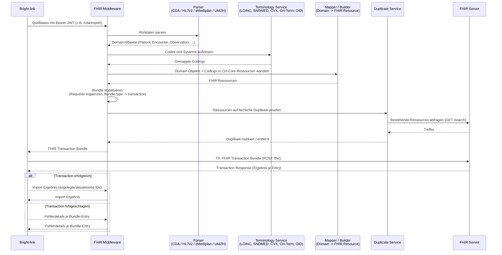

# Middleware intern: Verarbeitung und FHIR-Transaktion (TX)

Dieses Diagramm zoomt in die FHIR Middleware hinein und zeigt, welche internen
Komponenten bei einem Convert- oder Import-Use-Case (CDA, HL7v2, eMediplan, UMZH, ...)
zusammenarbeiten. Die Middleware erzeugt und validiert das Transaction-Bundle;
BridgeLink fuehrt den Write gegen den FHIR-Server aus. Es ergaenzt [SEQUENZDIAGRAMM-BRIGHT-LINK.md](SEQUENZDIAGRAMM-BRIGHT-LINK.md),
das die Aussensicht von Bright-link auf die Middleware beschreibt.

## Beteiligte Komponenten

| Komponente | Aufgabe |
| --- | --- |
| Bright-link | Ruft die Middleware mit Bearer JWT auf, schreibt deren Transaction-Bundle nach HAPI und liefert das Ergebnis zurueck. |
| Parser | Wandelt CDA/HL7v2/eMediplan/UMZH-Rohdaten in Domain-Objekte (`app/parser`, `app/domain`). |
| Terminology Service | Loest Codes gegen LOINC, SNOMED, CVX, CH-Term und OID auf (`app/terminology`). |
| Mapper / Builder | Erzeugt CH-Core-konforme FHIR-Ressourcen aus Domain-Objekten (`app/mappers`, `app/builders`). |
| Duplicate Service | Prueft vor dem Import bestehende FHIR-Ressourcen auf fachliche Duplikate (`fhir_duplicate_service.py`). |
| FHIR Server | Fuehrt die von BridgeLink gestartete Transaktion (TX) aus und persistiert die Ressourcen. |

TX bezeichnet hier das FHIR Transaction Bundle (`Bundle.type = transaction`), das
die Middleware nach Stabilisierung und Duplikatpruefung an BridgeLink zur
Weiterleitung an den FHIR-Server zurueckgibt; der FHIR-Server beantwortet jeden
Bundle-Entry einzeln.
</content>
